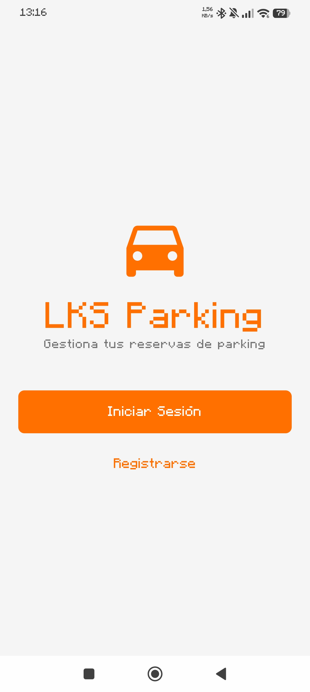
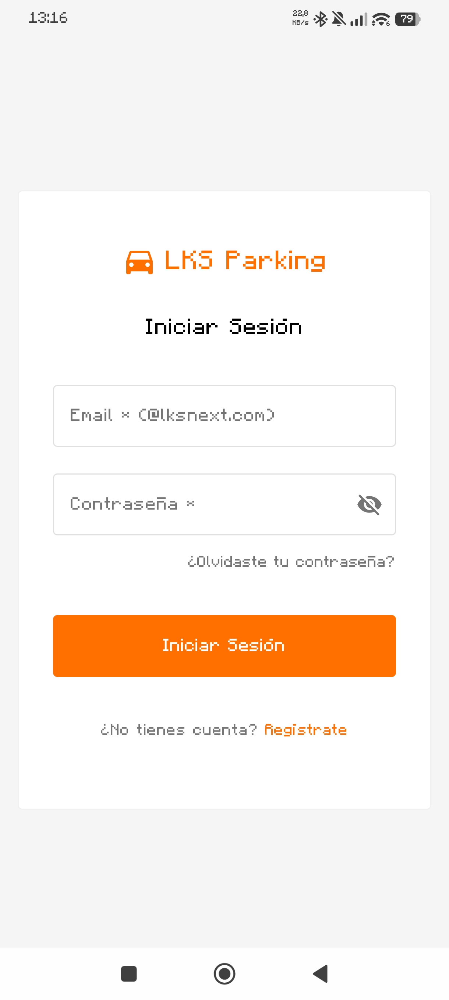
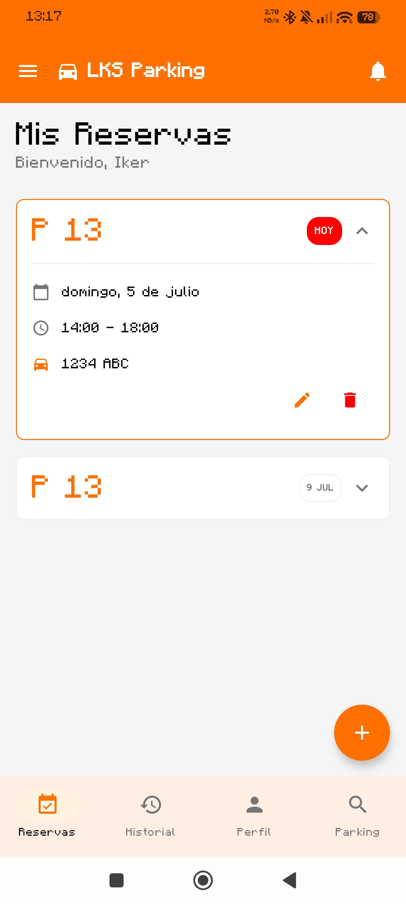
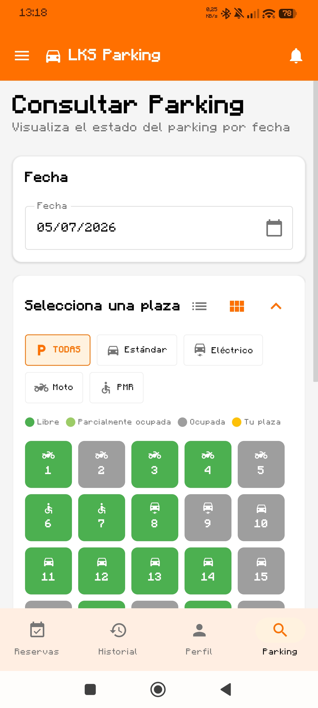
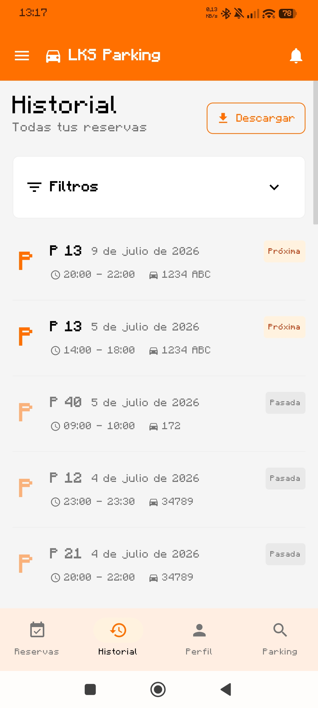
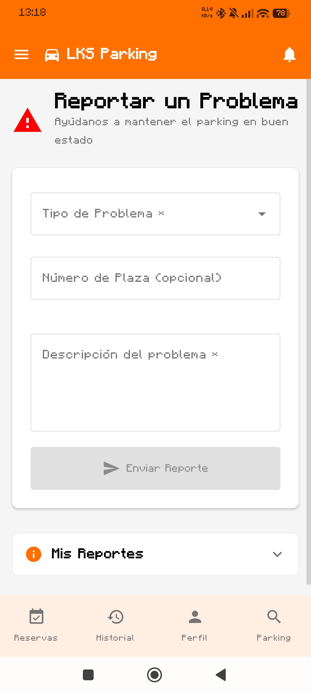

🇬🇧 [English](README.md) | 🇪🇸 **Español** | 🇪🇺 [Euskara](README.eu.md)

# LKS Parking


---

## Descripción
Aplicación móvil para la gestión de reservas de plazas de parking en las oficinas de LKS Next.
Este proyecto ha sido desarrollado durante el **Aula de Empresa de Movilidad de LKS Next y la UPV/EHU 2026.**

---

## Características Principales
- **Autenticación**: Registro e inicio de sesión con validación de correo corporativo (@lksnext.com).
- **Reservas**: Sistema de reserva de plazas con selección de fecha y tramos horarios (máx. 7 días de antelación y 9 horas de duración). Posibilidad de cancelación.
- **Visualización**: Mapa interactivo del estado del parking en tiempo real (Vista Cuadrícula y Lista).
- **Gestión de Vehículos**: Registro de múltiples vehículos (Coche estándar, Eléctrico, Moto, PMR).
- **Historial**: Consulta de reservas pasadas, activas y futuras con indicador de estado.
- **Notificaciones**: Avisos sobre confirmaciones, cancelaciones y recordatorios automáticos (FCM y locales).
- **Reportes**: Sistema para informar de incidencias (daños, limpieza, ocupación indebida).
- **Internacionalización**: Soporte para Español, Inglés y Euskera.

**[Prototipo interactivo en Figma](https://ardent-harp-31107545.figma.site)**

---

# Capturas de pantalla

<p align="center">
  
  
  
</p>

<p align="center">
  
  
  
</p>

---

# Roadmap y Planes Futuros

## Completado

- [x] Firebase Authentication
- [x] Cloud Firestore (NoSQL)
- [x] Firebase Cloud Messaging (FCM)
- [x] Firebase Crashlytics + Performance Monitoring
- [x] Tests unitarios de ViewModels (MockK)
- [x] Pipeline CI/CD mediante GitHub Actions
- [x] Análisis estático de código (Detekt & Lint)
- [x] Reportes de cobertura con JaCoCo
- [x] Integración con SonarCloud

## Próximamente (post Presentación final del proyecto)

- [ ] Chatbot basado en IA.
- [ ] Predicción de ocupación del parking.
- [ ] Nuevas funcionalidades.

---

# Requisitos

- Android Studio Ladybug (2024.2.1) o superior.
- Android SDK 24 (Min) / 36 (Target).
- JDK 17.
- Gradle Wrapper (incluido en el proyecto).

---

## Descargar

La forma más sencilla de probar la aplicación es descargando la última APK desde la página de **Releases**.

---

# Instalación y Configuración
1. Clonar el repositorio:
   ```bash
   git clone https://github.com/imayordomo/LKS_Parking.git
   ```
2. Abrir el proyecto en **Android Studio**.
3. Sincronizar Gradle.
4. Ejecutar en un emulador o dispositivo físico con **Android 7.0 (API 24) o superior**.

---

# Información para Desarrolladores

---

Recursos técnicos locales:
- **[DEVELOPER_GUIDE.md](docs/DEVELOPER_GUIDE.md)**: Guía detallada sobre arquitectura, estándares de código y flujo de trabajo.
- **[COMMANDS.md](docs/COMMANDS.md)**: Listado de comandos útiles para el desarrollo y testing.

Recursos técnicos externos:
- **[GitHub Wiki](https://github.com/imayordomo/LKS_Parking/wiki)**: Información más detallada en la página Wiki del repositorio de GitHub.
- **[DeepWiki](https://deepwiki.com/imayordomo/LKS_Parking)**: Documentación detallada disponible en DeepWiki.

---

# Stack tecnológico

| Tecnología | Implementación |
|------------|----------------|
| Lenguaje | Kotlin 2.2.10 |
| UI | Jetpack Compose (BOM 2024.12.01) |
| Arquitectura | MVVM |
| Navegación | Compose Navigation |
| Gestión de Estado | StateFlow |
| Inyección de dependencias | ViewModelFactory (manual) |
| Backend | Firebase (Auth, Firestore, Messaging, Crashlytics, Perf) |
| Calidad | Detekt, JaCoCo, SonarCloud |
| Idiomas | Castellano, Euskera, Inglés |

---

# Arquitectura

El proyecto sigue una arquitectura **MVVM (Model-View-ViewModel)**.

```text
app/src/main/java/com/lksnext/ParkingIMayordomo/
├── data/          # Modelos, repositorios (Firebase) y AuthManager
├── ui/            # Screens (Pages), ViewModels, components y theme
├── utils/         # Helpers, constantes y LocaleManager
└── MainActivity   # Punto de entrada y navegación
```

---

# Contribución

Actualmente este proyecto forma parte del Aula de Empresa de Movilidad de LKS Next y la UPV/EHU, por lo que no se aceptan contribuciones externas de momento.

---

# Contacto
Si tienes alguna duda, sugerencia o detectas algún problema, puedes abrir un **Issue** en este repositorio o contactar con **imayordomo**.
