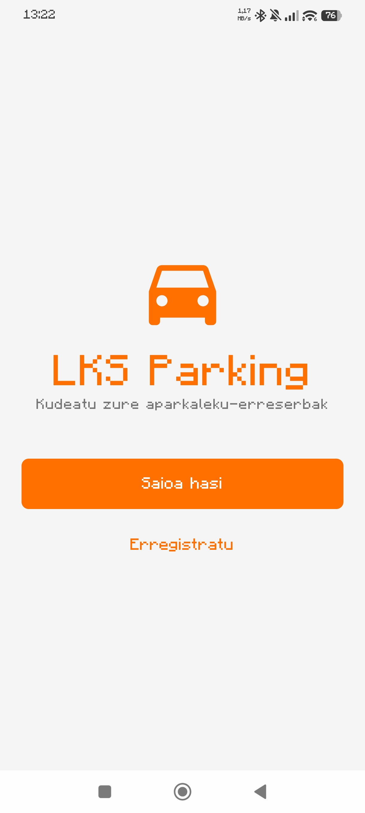
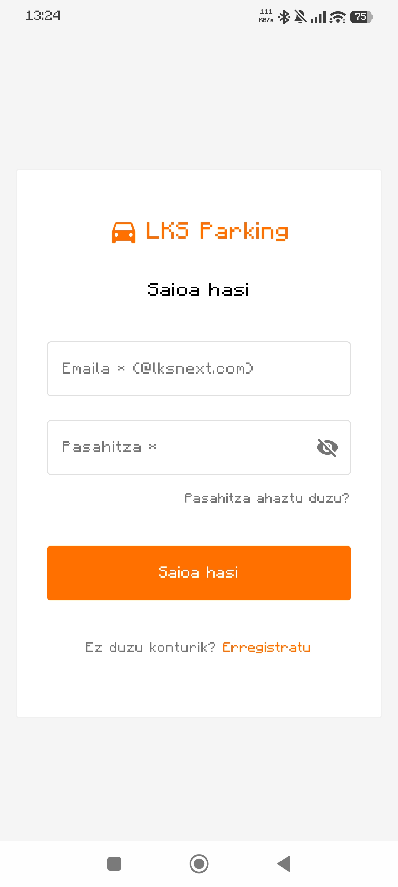
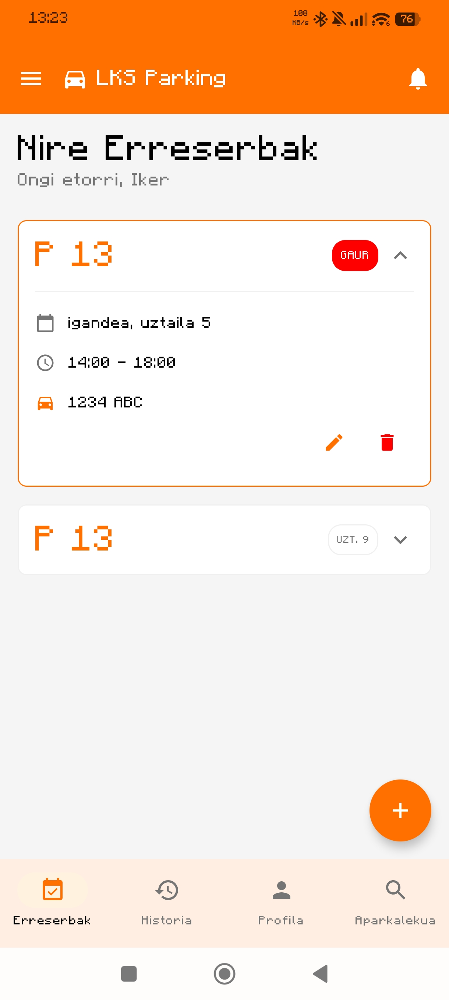
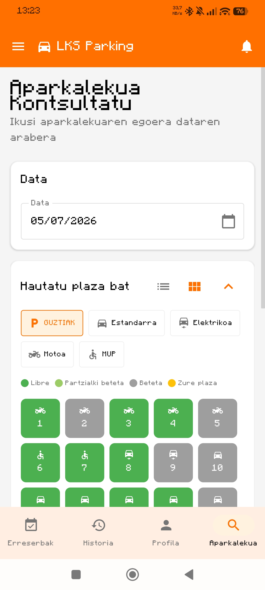
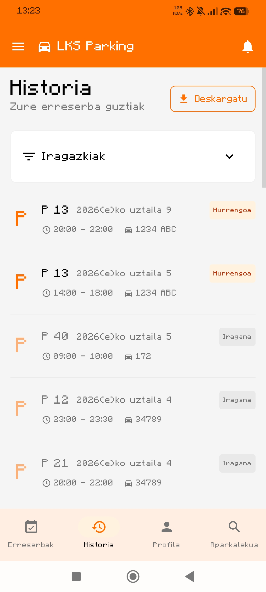
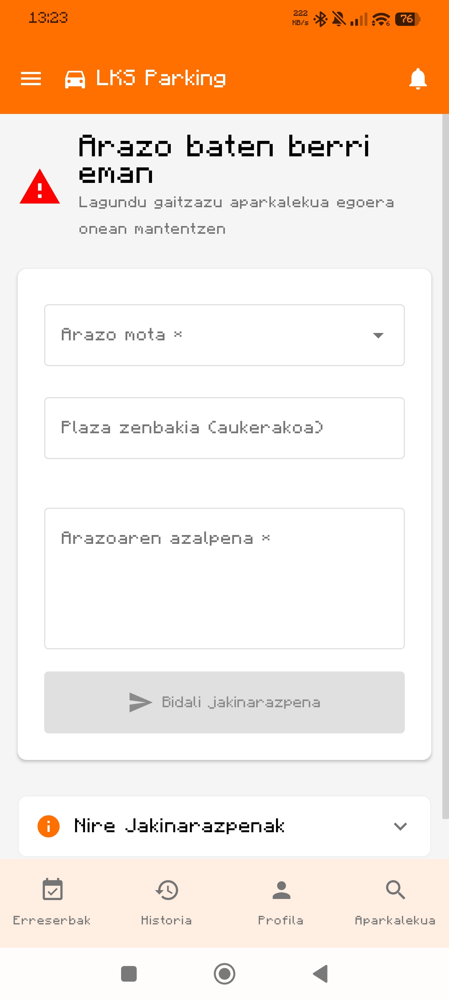

🇬🇧 [English](README.md) | 🇪🇸 [Español](README.es.md) | 🇪🇺 **Euskara**

# LKS Parking


---

## Deskribapena
LKS Next-en bulegoetako aparkaleku-plazak erreserbatzeko aplikazio mugikorra.
Proiektu hau **LKS Next eta UPV/EHUren 2026ko Mugikortasun Enpresa-Gelaren** barruan garatu da.

---

## Ezaugarri Nagusiak
- **Autentifikazioa**: Erregistratzea eta saioa hastea helbide korporatiboarekin (@lksnext.com).
- **Erreserbak**: Plazak erreserbatzeko sistema, data eta ordu-tarteak aukeratuta (gehienez 7 egun lehenago eta 9 orduko iraupena). Ezeztatzeko aukera.
- **Bistaratzea**: Aparkalekuaren egoeraren mapa interaktiboa denbora errealean (Lauki-sarean edo Zerrendan).
- **Ibilgailuen Kudeaketa**: Hainbat ibilgailu erregistratzea (Auto estandarra, Elektrikoa, Motoa, PMR).
- **Historiala**: Iraganeko, uneko eta etorkizuneko erreserbak kontsultatzea, egoera-adierazleekin.
- **Jakinarazpenak**: Erreserben konfirmazioak, ezeztapenak eta oroigarri automatikoak (FCM eta lokalak).
- **Txostenak**: Gorabeheren berri emateko sistema (kalteak, garbiketa, okupazio okerra).
- **Internazionalizazioa**: Gaztelania, Ingelesa eta Euskara onartzen dira.

**[Figma prototipo interaktiboa](https://ardent-harp-31107545.figma.site)**

---

# Pantaila-argazkiak

<p align="center">
  
  
  
</p>

<p align="center">
  
  
  
</p>

---

# Roadmap eta Etorkizuneko Planak

## Osatuta
- [x] Firebase Authentication
- [x] Cloud Firestore (NoSQL)
- [x] Firebase Cloud Messaging (FCM)
- [x] Firebase Crashlytics + Performance Monitoring
- [x] ViewModel-en unitate-testak (MockK)
- [x] CI/CD Pipelinea GitHub Actions bidez
- [x] Kodearen analisi estatikoa (Detekt & Lint)
- [x] Estaldura-txostenak JaCoCo-rekin
- [x] SonarCloud integrazioa

## Laster (Proiektuaren amaierako aurkezpenaren ondoren)
- [ ] IA bidezko Chatbota.
- [ ] Aparkalekuaren okupazioaren iragarpena.
- [ ] Funtzionalitate berriak.

---

# Baldintzak

- Android Studio Ladybug (2024.2.1) edo berriagoa.
- Android SDK 24 (Min) / 36 (Target).
- JDK 17.
- Gradle Wrapper (proiektuan sartuta).

---

## Deskargatu

Aplikazioa probatzeko modurik errazena **Releases** orrialdetik azken APK-a deskargatzea da.

---

# Instalazioa eta Konfigurazioa
1. Errepositorioa klonatu:
   ```bash
   git clone https://github.com/imayordomo/LKS_Parking.git
   ```
2. Proiektua **Android Studio**-rekin ireki.
3. Gradle sinkronizatu.
4. Exekutatu emuladore batean edo gailu fisiko batean (**Android 7.0 (API 24) edo berriagoa**).

---

# Garatzaileentzako Informazioa

Informazio tekniko zehatza hemen eskura daiteke:
- **[GitHub Wiki](https://github.com/imayordomo/LKS_Parking/wiki)**: Errepositorioan integratutako dokumentazioa.
- **[Deep Wiki](https://deepwiki.com/imayordomo/LKS_Parking/1-lks-parking-project-overview)**: Osagarri gisa, proiektuaren ikuspegi orokorra eta arkitektura hedatua.

Tokiko baliabide teknikoak:
- **[docs/DEVELOPER_GUIDE.md](docs/DEVELOPER_GUIDE.md)**: Arkitekturari, kode-estandarrei eta lan-fluxuari buruzko gida zehatza.
- **[docs/COMMANDS.md](docs/COMMANDS.md)**: Garapenerako eta testetarako komando erabilgarrien zerrenda.

---

# Stack teknologikoa

| Teknologia | Inplementazioa |
|------------|----------------|
| Hizkuntza | Kotlin 2.2.10 |
| UI | Jetpack Compose (BOM 2024.12.01) |
| Arkitektura | MVVM |
| Nabigazioa | Compose Navigation |
| Egoeraren Kudeaketa | StateFlow |
| Dependentzia-injekzioa | ViewModelFactory (eskuzkoa) |
| Backend | Firebase (Auth, Firestore, Messaging, Crashlytics, Perf) |
| Kalitatea | Detekt, JaCoCo, SonarCloud |
| Hizkuntzak | Gaztelania, Euskara, Ingelesa |

---

# Arkitektura

Proiektuak **MVVM (Model-View-ViewModel)** arkitektura jarraitzen du.

```text
app/src/main/java/com/lksnext/ParkingIMayordomo/
├── data/          # Modeloak, errepositorioak (Firebase) eta AuthManager
├── ui/            # Pantailak (Pages), ViewModel-ak, osagaiak eta theme
├── utils/         # Helper-ak, konstanteak eta LocaleManager
└── MainActivity   # Sarrera-puntua eta nabigazioa
```

---

# Kolaborazioa

Gaur egun, proiektu hau LKS Next eta UPV/EHUren Mugikortasun Enpresa-Gelaren parte da, beraz, ez da kanpoko kolaboraziorik onartzen une honetan.

---

# Kontaktua
Zalantzaren bat baduzu, iradokizunik baduzu edo arazoren bat aurkitzen baduzu, **Issue** bat ireki dezakezu errepositorio honetan edo **imayordomo**-rekin harremanetan jarri.
