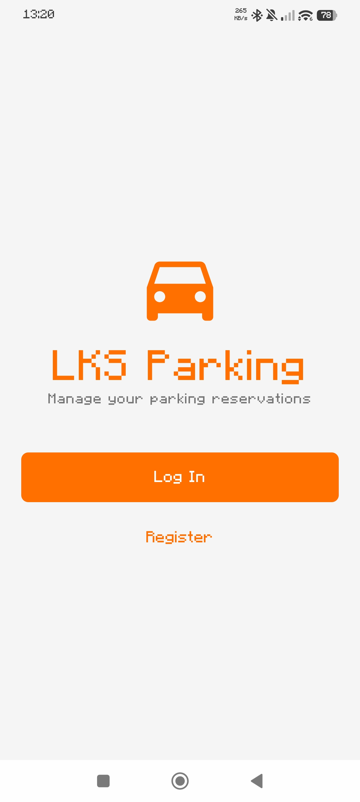
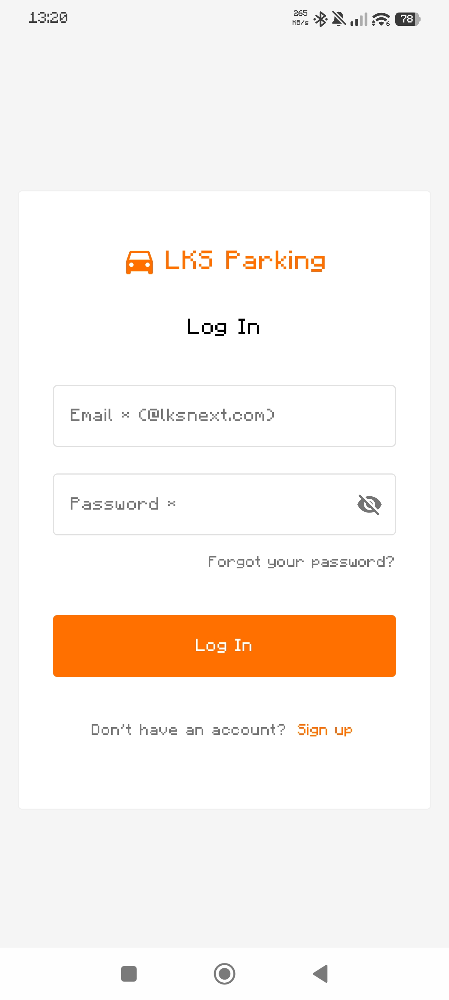
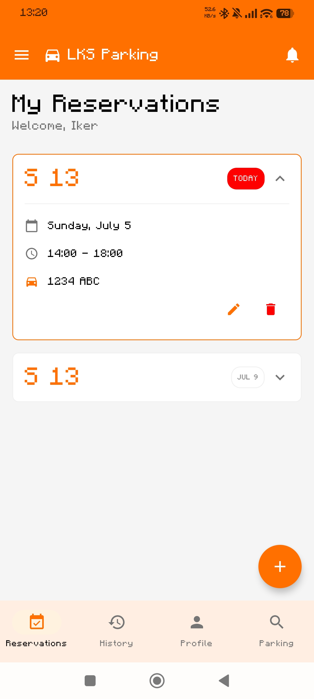
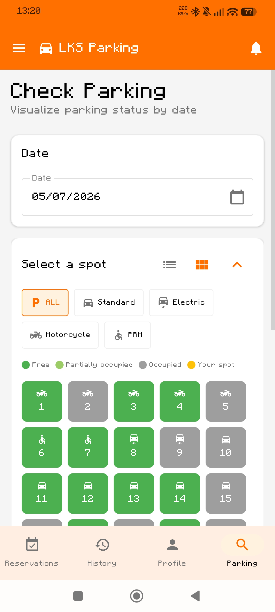
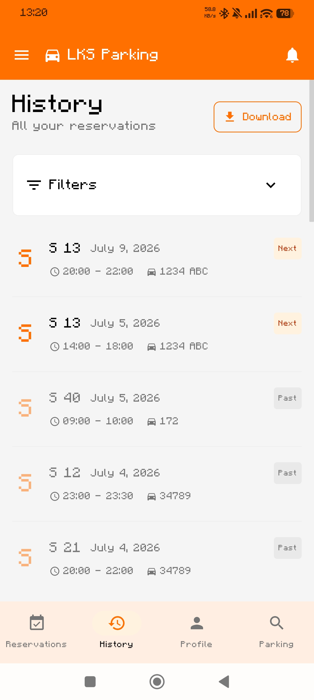
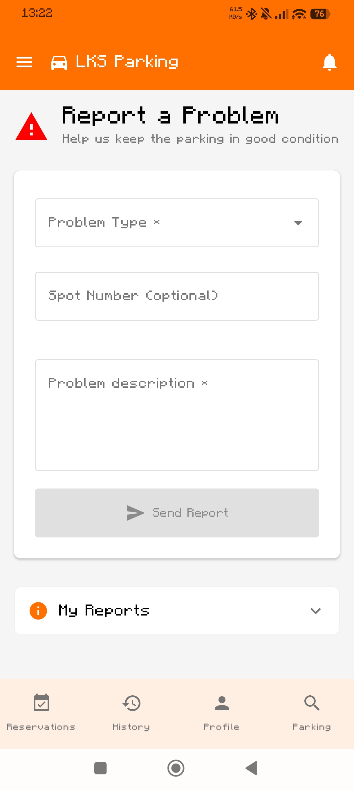

🇬🇧 **English** | 🇪🇸 [Español](README.es.md) | 🇪🇺 [Euskara](README.eu.md)

# LKS Parking


---

## Description
Mobile application for managing parking space reservations at LKS Next offices.
This project was developed during the **LKS Next and UPV/EHU Mobility Business Classroom 2026.**

---

## Key Features
- **Authentication**: Registration and login with corporate email validation (@lksnext.com).
- **Reservations**: Parking space reservation system with date and time slot selection (max. 7 days in advance and 9 hours duration). Cancellation possibility.
- **Visualization**: Interactive map of parking status in real-time (Grid and List View).
- **Vehicle Management**: Registration of multiple vehicles (Standard car, Electric, Motorcycle, PRM).
- **History**: Consultation of past, active, and future reservations with status indicators.
- **Notifications**: Notices about confirmations, cancellations, and automatic reminders (FCM and local).
- **Reports**: System for reporting incidents (damage, cleaning, improper occupancy).
- **Internationalization**: Support for Spanish, English, and Basque.

**[Interactive Figma Prototype](https://ardent-harp-31107545.figma.site)**

---

# Screenshots

<p align="center">
  
  
  
</p>

<p align="center">
  
  
  
</p>

---

# Roadmap and Future Plans

## Completed

- [x] Firebase Authentication
- [x] Cloud Firestore (NoSQL)
- [x] Firebase Cloud Messaging (FCM)
- [x] Firebase Crashlytics + Performance Monitoring
- [x] ViewModel Unit Tests (MockK)
- [x] CI/CD Pipeline via GitHub Actions
- [x] Static code analysis (Detekt & Lint)
- [x] Coverage reports with JaCoCo
- [x] SonarCloud integration

## Coming Soon (Post-project final presentation)

- [ ] AI-based Chatbot.
- [ ] Parking occupancy prediction.
- [ ] New features.

---

# Requirements

- Android Studio Ladybug (2024.2.1) or higher.
- Android SDK 24 (Min) / 36 (Target).
- JDK 17.
- Gradle Wrapper (included in the project).

---

## Download

The easiest way to test the application is by downloading the latest APK from the **Releases** page.

---

# Installation and Configuration
1. Clone the repository:
   ```bash
   git clone https://github.com/imayordomo/LKS_Parking.git
   ```
2. Open the project in **Android Studio**.
3. Sync Gradle.
4. Run on an emulator or physical device with **Android 7.0 (API 24) or higher**.

---

# Developer Information

---

Local technical resources:
- **[DEVELOPER_GUIDE.md](docs/DEVELOPER_GUIDE.md)**: Detailed guide on architecture, code standards, and workflow.
- **[COMMANDS.md](docs/COMMANDS.md)**: List of useful commands for development and testing.

External technical resources:
- **[GitHub Wiki](https://github.com/imayordomo/LKS_Parking/wiki)**: More detailed information on the project's Wiki page.
- **[DeepWiki](https://deepwiki.com/imayordomo/LKS_Parking)**: Detailed documentation available on DeepWiki.

---

# Tech Stack

| Technology | Implementation |
|------------|----------------|
| Language | Kotlin 2.2.10 |
| UI | Jetpack Compose (BOM 2024.12.01) |
| Architecture | MVVM |
| Navigation | Compose Navigation |
| State Management | StateFlow |
| Dependency Injection | ViewModelFactory (manual) |
| Backend | Firebase (Auth, Firestore, Messaging, Crashlytics, Perf) |
| Quality | Detekt, JaCoCo, SonarCloud |
| Languages | Spanish, Basque, English |

---

# Architecture

The project follows an **MVVM (Model-View-ViewModel)** architecture.

```text
app/src/main/java/com/lksnext/ParkingIMayordomo/
├── data/          # Models, repositories (Firebase) and AuthManager
├── ui/            # Screens (Pages), ViewModels, components and theme
├── utils/         # Helpers, constants and LocaleManager
└── MainActivity   # Entry point and navigation
```

---

# Contribution

Currently, this project is part of the LKS Next and UPV/EHU Mobility Business Classroom, so external contributions are not accepted at the moment.

---

# Contact
If you have any questions, suggestions, or detect any issues, you can open an **Issue** in this repository or contact **imayordomo**.
